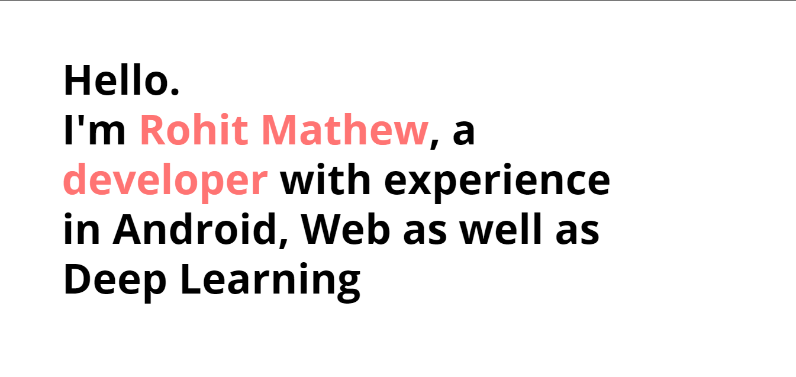

# Personal Portfolio

Please do try it: [Link](https://rohitjmathew.xyz)

*The website targets the latest version of Chrome, Safari, and Firefox.*

## How to get your own?
1. Fork the repo
2. Rename the repo as `your-user-name.github.com`
3. Check at [http://your-user-name.github.com](http://your-user-name.github.com)
4. Start making changes!

